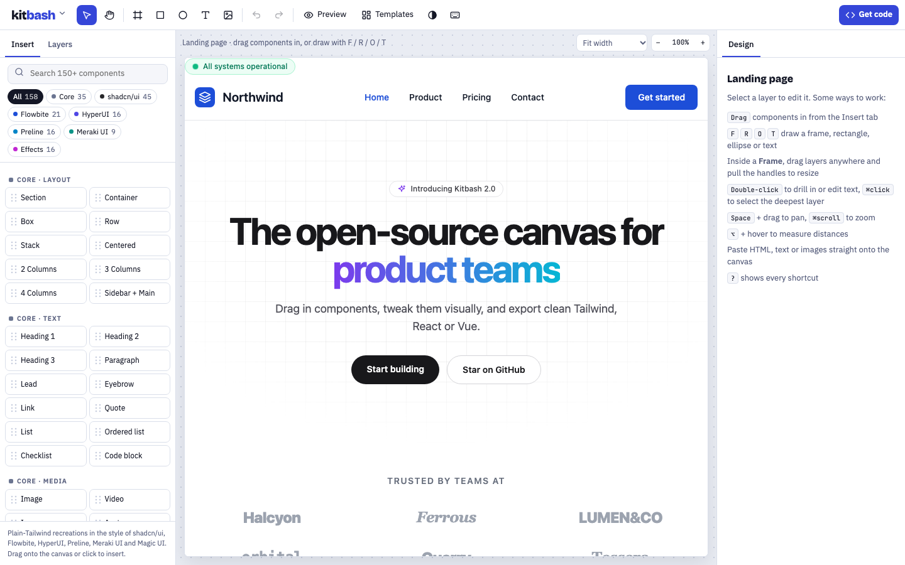

<div align="center">

# kitbash

**An open-source, Figma-style canvas for building real UI with Tailwind components.**
Drag in 180+ components, move and resize anything, then export clean HTML, React or Vue.

[**Open the editor →**](https://alps-is-core.github.io/kitbash/)

[](https://github.com/Alps-is-Core/kitbash/actions/workflows/ci.yml)
[](https://github.com/Alps-is-Core/kitbash/actions/workflows/pages.yml)
[](LICENSE)




</div>

## Why

Design tools draw pictures of UI. Page builders lock you into their runtime. Kitbash sits in between: the canvas **is** the DOM, every layer is plain Tailwind markup, and what you export is exactly what you see. No account, no backend, no build step.

## Features

**Canvas**
- Drag-and-drop from a library of **187 components** across 9 kits
- **Canva-style editing**: click selects a whole component, double-click jumps straight to the element under the cursor and starts typing if it's text
- **Ungroup any component** (⇧⌘G) into free pieces that keep their exact look; each piece can then be dragged, resized or edited on its own
- **Frames** with freeform positioning: drag layers anywhere, pull 8 handles to resize, rotate, and snap to **smart guides**
- Flow layouts too: drag to reorder inside stacks, rows and grids with a live insertion line
- Drawing tools: **Frame (F)**, **Rectangle (R)**, **Ellipse (O)**, **Text (T)**, place image
- **Zoom & pan**: ⌘-scroll, ⌘+ / ⌘−, ⇧1 fit, Space-drag or the Hand tool
- Responsive widths: fit, 1440, 1280, 1024, 820, 390
- **⌥-hover measuring** of distances between layers
- Marquee and ⇧-click multi-select; align and distribute
- Layers inside a frame are selectable with one click; ⌘-click selects the deepest layer
- Right-click context menu with everything below

**Layers & structure**
- **Layers panel** with tree, type icons, rename, hide, lock and drag-to-reorder
- **Pages**, each with its own undo history
- Group / ungroup, frame selection, bring forward / send back
- **Auto layout** (⇧A): direction, wrap, gap, padding and a 3×3 alignment grid
- **Components**: save any selection to your own library (⌥⌘K) and reuse it

**Design panel**
- Position (auto / absolute), X / Y / W / H, Hug / Fill / Fixed sizing, rotation, clipping
- Fill, stroke and text colors with Tailwind swatches or any custom hex
- Radius, opacity, shadow, blur, backdrop blur
- Typography: family, size (preset or px), weight, line height, letter spacing, alignment, style
- Raw Tailwind class editor and an HTML editor for the selected layer

**Output**
- Export **HTML**, **React (JSX)**, **Vue SFC** or a **full HTML page**, for the whole page or just the selection
- Copy as HTML / JSX straight from the context menu; ⌘C puts HTML on the system clipboard
- Paste HTML, text or images straight onto the canvas
- Save and open `.kitbash.json` project files; everything autosaves locally

## Component kits

| Kit | Components | Style |
|---|---:|---|
| Core | 35 | Layout primitives, text, media, frames and shapes |
| shadcn/ui | 45 | Buttons, forms, overlays, data, dashboard cards |
| Flowbite | 21 | Navbars, heroes, feature grids, timeline, toasts |
| HyperUI | 16 | Marketing sections, pricing, FAQ, e-commerce |
| Preline | 16 | App shells, tables, kanban, invoice, settings |
| Meraki UI | 9 | Auth, 404, gallery, comments, coming soon |
| Effects | 16 | Magic UI / Aceternity-style motion and backgrounds |
| daisyUI | 17 | Colorful buttons, stats, chat, countdown, browser / code / phone mockups |
| Tailblocks | 12 | Landing sections: hero, features, pricing, steps, contact, footer |

> Every component is **original plain-Tailwind markup written in the visual style** of the named MIT-licensed kit. Nothing is copied verbatim, nothing needs the kit installed, and you can paste official markup in with **Import HTML** whenever you want the real thing. Icons are [Lucide](https://lucide.dev) paths (ISC).

## Run it locally

No dependencies. Node 18+ only for the dev server and tests.

```bash
git clone https://github.com/Alps-is-Core/kitbash.git
cd kitbash
npm run dev      # http://localhost:5173
npm test         # validates the component library
```

You can also open `index.html` through any static server.

## How it works

```
index.html          editor shell
src/styles.css      editor chrome (light + dark)
src/components.js   the component library + templates (window.KB_LIB)
src/app.js          the editor: canvas, gestures, layers, design panel, export
tests/              library validation (node:test)
scripts/dev.mjs     zero-dependency static server
```

- The page you design lives in a same-origin `<iframe>` running the Tailwind Play CDN, so responsive breakpoints behave exactly like production.
- Layers are ordinary DOM nodes. Builder-only state is stored in `data-*` attributes (`data-kb` layer name, `data-drop` accepts children, `data-free` freeform frame, `data-kb-lock`, `data-kb-hidden`) and stripped on export.
- Freeform positions and sizes are written as Tailwind arbitrary values (`absolute left-[120px] top-[48px] w-[320px]`), so the export stays pure Tailwind.
- Selection boxes, handles and guides are overlay nodes inside the iframe, counter-scaled by the zoom level.

## Add a component

Open `src/components.js` and call `add()` in the right kit section:

```js
add('shadcn', 'Feedback', 'Banner', `<div class="rounded-lg border border-zinc-200 p-4 text-sm">Hello</div>`);
```

- One root element per component.
- Mark a container that should accept nested drops with `data-drop`. Add `data-free` too for freeform placement.
- Use the `ic()` helper for icons and `ph()` for placeholder images (no remote images).
- Run `npm test`; it checks ids, templates and that the markup is balanced.

## Keyboard shortcuts

Press **?** in the editor for the full list. The essentials:

| | |
|---|---|
| Tools | `V` move · `H` hand · `F` frame · `R` rectangle · `O` ellipse · `T` text |
| Select | click · double-click into a component / edit text · `⇧`click · `⌘`click deepest · `↵` / `⇧↵` child / parent · `⌘A` |
| Edit | `⌘C` `⌘X` `⌘V` · `⌘D` · `⌫` · `⌘Z` / `⇧⌘Z` · `⌘G` / `⇧⌘G` · `⌥⌘K` component · `⇧A` auto layout |
| Arrange | arrows nudge (`⇧` ×10) · `⌘]` / `⌘[` · `⌥` + hover to measure |
| View | `⌘` + scroll / `⌘+` / `⌘−` zoom · `⇧1` fit · `⇧0` 100% · `⌥⌘P` preview |

## Limitations

- Freeform frames use fixed pixel positions, so they don't reflow on small screens. Use auto layout for responsive sections.
- The exported full page uses the Tailwind Play CDN for convenience; for production, paste the markup into a project with Tailwind v3 installed.
- No real-time collaboration, vector pen tool, prototyping links or plugins yet.

## Roadmap

- [ ] Responsive overrides per breakpoint (edit `md:` / `lg:` styles visually)
- [ ] Component variants and instance overrides
- [ ] Design tokens / theme editor
- [ ] Export to Tailwind v4 and to Svelte
- [ ] Shareable project links

## Contributing

Issues and pull requests are welcome. See [CONTRIBUTING.md](CONTRIBUTING.md).

## License

[MIT](LICENSE)
